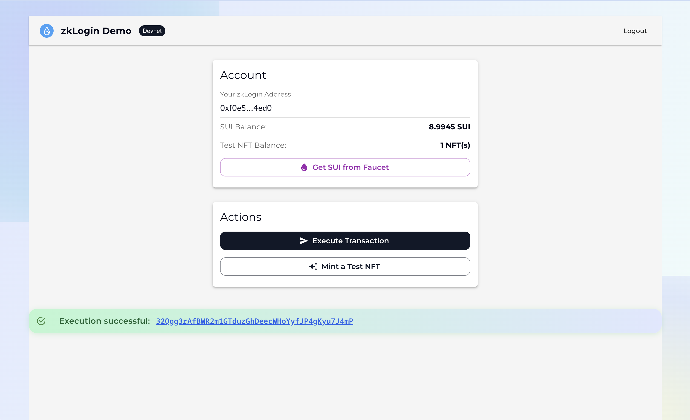

## 画面イメージ



# ようこそ！Sui zkLogin ハンズオン

このリポジトリは「Google アカウントで zkLogin を体験し、Sui ブロックチェーンで送金 & NFT ミントを試す」ための教材です。  
バックエンド（Bun）とフロントエンド（Vite + React）がセットになっており、データベースは不要です。

---

## 1️⃣ 事前インストール（15 分）

| 必須ツール | 推奨バージョン | インストール方法 |
|------------|----------------|------------------|
| Bun | 1.1 以上 | **macOS / Linux**:`curl -fsSL https://bun.sh/install \| bash`<br>**Homebrew:**`brew install oven-sh/bun/bun`<br>**Windows:** PowerShell:`iwr bun.sh/install.ps1 -useb \| iex` |
| Node.js | 18 以上 | [公式サイト](https://nodejs.org/) / nvm など |
| Git | 最新推奨 | すでに入っていることが多いですが、不明な場合はインストール |

インストール後は `bun --version` などで動作確認してください。

---

## 2️⃣ リポジトリの準備

```bash
git clone https://github.com/numa/sui-zklogin-app.git
cd sui-zklogin-app
bun install

# フロントエンド用 .env を作成
cat <<'EOF' > packages/frontend/.env
VITE_GOOGLE_CLIENT_ID=
VITE_REDIRECT_URI=http://localhost:5173/

VITE_SUI_NETWORK_NAME=devnet
VITE_SUI_FULLNODE_URL=https://fullnode.devnet.sui.io
VITE_SUI_DEVNET_FAUCET=https://faucet.devnet.sui.io
VITE_SUI_PROVER_DEV_ENDPOINT=https://prover-dev.mystenlabs.com/v1
EOF

# バックエンド用 .env を作成
cat <<'EOF' > packages/backend/.env
PORT=3001
SEED=
EXPECTED_ISS=https://accounts.google.com
EXPECTED_AUD=
EOF
```

> `bun install` は backend / frontend 両方の依存をまとめて入れます。

上記コマンドで `.env` ファイルが生成されます。空欄のままになっている値（`VITE_GOOGLE_CLIENT_ID` や `SEED` など）は次のステップで入力します。

---

## 3️⃣ Google Cloud のセットアップ（10 分）

Google の ID トークンを使うため、各自で OAuth クライアント ID を発行します。アカウントを持っていなければ先に作成してください。生徒 1 人ずつこの手順を実施します。

- 画像付きの解説はこちら: https://buidl.unchain.tech/Sui/Sui-zklogin/section-1/lesson-1
- [Google Cloud コンソール › API とサービス › 認証情報](https://console.cloud.google.com/apis/credentials) へ移動
- 左メニューの **「OAuth 同意画面」** で「外部」を選び、アプリ名・サポートメールを入力して保存（テストモードでOK）
- 「認証情報を作成」→「OAuth クライアント ID」をクリック
- 設定は次のとおり
  - アプリケーションの種類: **ウェブアプリケーション**
  - 名前: `sui-zklogin`（任意の名前で可）
  - 承認済みのリダイレクト URI: `http://localhost:5173/`
- 作成完了後に表示される **クライアント ID** を控える（クライアントシークレットは今回は不要）
- テストモードのままで問題ありませんが、OAuth を使う Gmail アドレスを **テストユーザー** に登録しておくこと

この ID を `.env` の `VITE_GOOGLE_CLIENT_ID=` に書き込みます。設定を忘れると `redirect_uri_mismatch` エラーになります。

---

## 4️⃣ `.env` ファイルを作成しよう（5 分）

### 4-1. フロントエンド用 (`packages/frontend/.env`)

`VITE_GOOGLE_CLIENT_ID` に Google Cloud で発行したクライアント ID を貼り付けます。その他の値は既定のままで OK です。

```dotenv
VITE_GOOGLE_CLIENT_ID=ここにクライアントIDを貼り付け
VITE_REDIRECT_URI=http://localhost:5173/

# Sui Devnet と接続するための既定値（変更不要）
VITE_SUI_NETWORK_NAME=devnet
VITE_SUI_FULLNODE_URL=https://fullnode.devnet.sui.io
VITE_SUI_DEVNET_FAUCET=https://faucet.devnet.sui.io
VITE_SUI_PROVER_DEV_ENDPOINT=https://prover-dev.mystenlabs.com/v1
```

### 4-2. バックエンド用 (`packages/backend/.env`)

`SEED` と `EXPECTED_AUD`（クライアント ID）を忘れず設定してください。

> **SEED は当日会場で講師が共有します。** 事前に値を決めておく必要はありません。

```dotenv
PORT=3001
SEED=16バイト以上のランダム値(例: fc7b3a5c2d1e09ab45cd6789f01234ff)
EXPECTED_ISS=https://accounts.google.com
EXPECTED_AUD=ここにもクライアントIDを指定
```

- `SEED` は HKDF の根となる秘密値です。漏えいすると他の人も同じソルトを再計算できるため、リポジトリには絶対コミットしないでください。
- `EXPECTED_AUD` を設定すると、指定したクライアント ID 以外からの JWT を拒否します（セキュリティ向上）。

---

## 5️⃣ Sui Devnet を使う理由

デモでは実際に Sui のトランザクション（1 SUI 送金 / NFT ミント）を行います。そのため Devnet のノードと通信します。  
Sui との連携を体験しない場合は、フロントや README にある「送金」「NFT ミント」の部分をスキップしてください。

---

## 6️⃣ アプリを起動しよう

```bash
bun run dev
```

- バックエンド（HKDF サーバー）: `http://localhost:3001/hkdf`
- フロントエンド（React アプリ）: `http://localhost:5173/`

ブラウザで `http://localhost:5173/` を開き、**Sign in with Google** ボタンをクリックすると OAuth が始まります。  
ログイン成功後、ZK 証明の取得 → 送金／NFT ミントボタンが有効になります。

---

## 7️⃣ ハンズオンで体験する流れ

1. `bun run dev` を起動し `http://localhost:5173/` を開く  
2. 「Sign in with Google」→ OAuth フロー → ID トークンを取得  
3. 画面にウォレットアドレスが表示されたら **1 SUI 送金ボタン** を試す  
4. 続けて **NFT ミント** を試し、成功時に表示されるトランザクション digest を SuiScan で確認  
5. 途中で詰まったら Snackbar（画面右下の通知）とブラウザコンソールのエラーを確認

---

## 8️⃣ うまくいかないときのチェックポイント

| 症状 | 確認すること |
|------|--------------|
| `redirect_uri_mismatch` | Google Cloud Console に `http://localhost:5173/` を登録したか |
| `/hkdf` が 401/400 | `packages/backend/.env` の `EXPECTED_AUD` とクライアント ID が一致しているか |
| ZK Proof が生成されない | Prover API の URL がブロックされていないか、ブラウザの DevTools でネットワークエラーを確認 |
| 送金が失敗 | Devnet のガス残高が足りないかも。Faucet から SUI を補充する |

---

## 9️⃣ Devnet Faucet（必要に応じて）

Sui CLI をインストール済みの方は、以下で Devnet に接続＆ガス補充ができます。

```bash
sui client new-env --alias devnet --rpc https://fullnode.devnet.sui.io:443 --faucet https://faucet.devnet.sui.io/gas
sui client switch --env devnet
sui client faucet
```

ブラウザのみで参加する場合は、画面の「Faucet」リンクから Web UI を開いて補給できます。

---

## 10️⃣ さらに学びたい人へ

- [zkLogin Integration Guide (公式ドキュメント)](https://docs.sui.io/guides/developer/cryptography/zklogin-integration)
- [Sui Faucet (Devnet)](https://faucet.sui.io/?network=devnet)
- [Mysten zkLogin GitHub](https://github.com/MystenLabs)

改善提案や質問があれば Issue / PR を歓迎します。楽しいハンズオンにしましょう！
